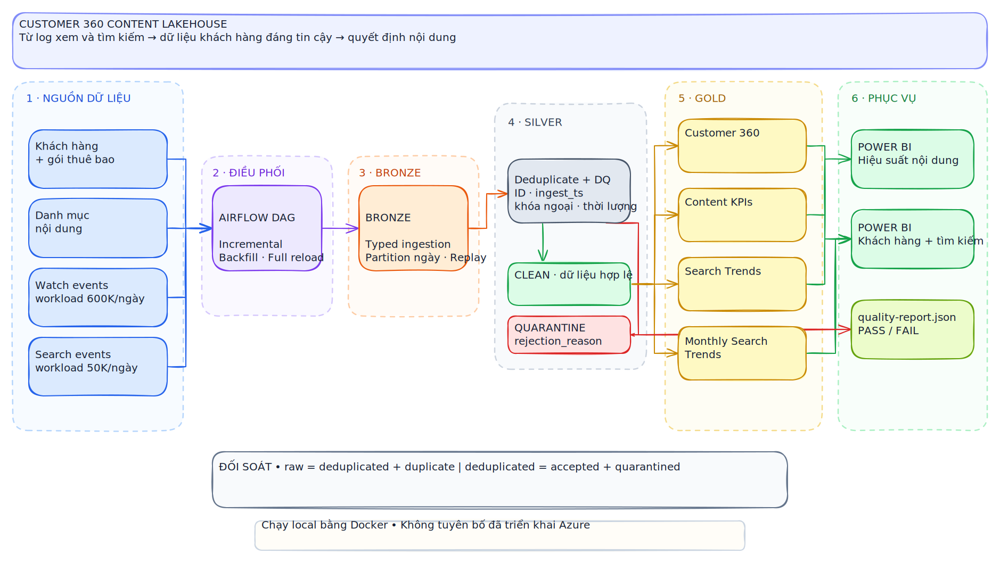

# Customer 360 Content Lakehouse

[](https://github.com/npgb2505/customer360-content-lakehouse/actions/workflows/ci.yml)
[](https://www.python.org/)
[](https://spark.apache.org/)
[](LICENSE)

An end-to-end Customer 360 data pipeline for a subscription content platform. PySpark
lands daily watch and search logs into a Bronze/Silver/Gold lakehouse, enforces
quality gates, rebuilds customer and content data products, and exports four
Power BI-ready datasets. It runs locally and requires no paid cloud account.

<p align="center">
  
</p>

<p align="center">
  <a href="docs/assets/architecture-c360.excalidraw">Editable Excalidraw source</a>
</p>

## At a glance

| Ingest & orchestration | Trust & modeling | Serve & explain |
|---|---|---|
| 📥 Daily watch/search partitions | 🧹 Deduplication + referential DQ | 📊 Four Power BI-ready marts |
| 🔁 Incremental, backfill, full reload | 🚧 Quarantine with rejection reason | ✅ Machine-readable quality report |
| 🗓️ One parameterized Airflow DAG | ⚖️ Row-count reconciliation | 🧭 Editable architecture source |

## Business problem

Content, search, catalog, and subscription data arrive at different grains. Analysts
need trustworthy answers to three decisions: which customer segments are engaged,
which titles/categories are growing or declining, and which searches reveal unmet
content demand. This repository delivers those products as a reproducible pipeline,
not a one-off notebook.

## What is implemented

- Deterministic generator for customers, catalog, watch events, and search events.
- Parameterized incremental, bounded backfill, and full-reload commands.
- Date-partitioned Bronze ingestion and idempotent partition replacement.
- Silver deduplication, referential validation, quarantine, and reconciliation.
- Gold Customer 360, content KPIs, daily search trends, and cross-month trends.
- Airflow DAG using the same public CLI as local runs and CI.
- Fixed-name CSV exports, Power BI model guidance, and tested DAX measures.
- Pytest, Ruff, Docker, GitHub Actions, data contract, data model, and runbook.

## Quick start

Requirements for a native install: Python 3.12 and Java 17. On Windows, Docker is
recommended because Apache Hadoop's native local filesystem tools are not bundled with
PySpark.

```bash
python -m venv .venv
# Windows: .venv\Scripts\activate
# macOS/Linux: source .venv/bin/activate
python -m pip install -r requirements.txt
customer360 demo --root data
```

The default demo generates four daily partitions across two calendar months. It writes:

```text
data/lakehouse/bronze/       replayable typed source records
data/lakehouse/silver/       accepted and quarantined records
data/lakehouse/gold/         analytics-ready Parquet products
powerbi/exports/             fixed-name CSV dashboard inputs
artifacts/quality-report.json
```

Run the same demo in a container:

```bash
docker compose up --build --abort-on-container-exit
```

## Operational modes

```bash
# Incremental daily load
customer360 run --root data --start-date 2025-02-01 --days 1 --mode incremental

# Bounded backfill
customer360 run --root data --start-date 2025-01-01 --days 31 --mode backfill

# Rebuild lakehouse outputs from existing raw partitions
customer360 run --root data --start-date 2025-01-01 --days 31 --mode full-reload
```

To exercise the requested scale on suitable hardware:

```bash
customer360 demo --root data --days 1 \
  --watch-events 600000 --search-events 50000 \
  --users 10300 --contents 1040 --invalid-events 100
```

The 600K/50K command is a configurable workload target, not a throughput benchmark.
Only values emitted in `artifacts/quality-report.json` should be reported as verified
execution evidence.

## Data products

| Product | Grain | Primary decisions |
|---|---|---|
| `customer_360` | one customer snapshot | plan, contract, region, engagement segment |
| `content_kpis` | date × title | views, viewers, watch time, completion |
| `search_trends` | date × normalized query × category | demand and click-through |
| `monthly_search_trends` | month × normalized query | emerging/declining interests |

Power BI import steps, visuals, and DAX are documented in [powerbi/README.md](powerbi/README.md).

## Reliability and quality

Duplicate IDs retain the latest `ingest_ts`; replay overwrites the affected partition
instead of appending it. Invalid customer/content references, empty searches, and
impossible watch duration are preserved with a rejection reason. Publication fails if
accepted plus quarantined rows do not reconcile to the deduplicated input or any gold
product is empty.

```bash
pytest -q
ruff check .
```

The tests prove deterministic generation, duplicate handling, quarantine,
reconciliation, repeatable output, and idempotent rerun behavior.

## Data source and privacy

The committed project contains no customer or Netflix data. Its generator is inspired
by the public, synthetic [Netflix 2025 User Behavior Dataset](https://www.kaggle.com/datasets/sayeeduddin/netflix-2025user-behavior-dataset-210k-records),
which is published under CC0. Generated names and events are fictional and safe for
portfolio demonstrations.

## Repository map

```text
airflow/dags/          scheduled orchestration
customer360/           generator, PySpark pipeline, CLI
docs/                  architecture, contracts, model, runbook
powerbi/               dashboard specification and generated exports
tests/                 unit and end-to-end tests
.github/workflows/     CI verification
```

## Limitations

- Local files emulate an object-store lakehouse; Azure ADLS deployment is not claimed.
- Power BI Desktop imports generated CSVs; no Power BI Service workspace is provisioned.
- Gold snapshots are rebuilt for clarity. A production deployment should use a
  transactional table format and catalog-level atomic publication.
- The synthetic workload demonstrates architecture and correctness, not real viewing
  behavior or production throughput.

## License

MIT. See [LICENSE](LICENSE).
