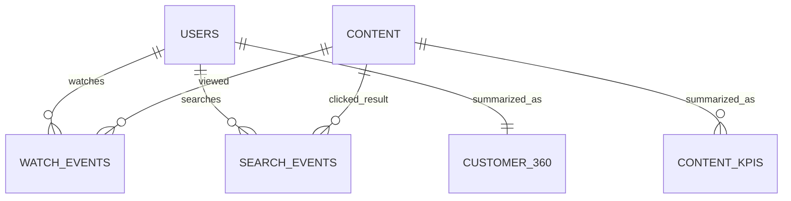

# Data model

`customer_360` is one current snapshot row per customer. `content_kpis` is one row per
date and content title. `search_trends` is one row per date, normalized query, and
result category. `monthly_search_trends` is one row per month and normalized query.
